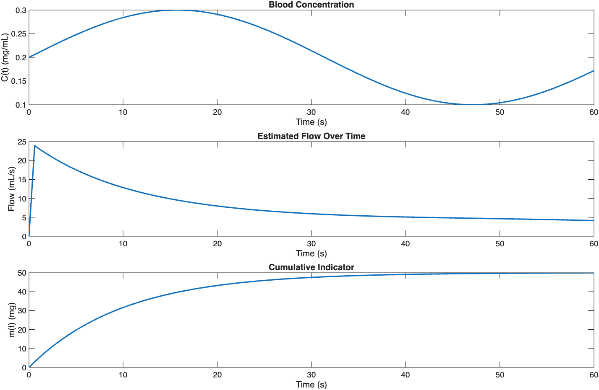

# Fick’s Principle Blood Flow Estimation (MATLAB)

## Overview
This project estimates blood flow using Fick’s Principle, a fundamental physiological method relating oxygen consumption to arterial–venous concentration differences. MATLAB is used to implement the mathematical model and visualize the resulting blood flow estimates.

## Tools
- MATLAB

## Methods
The analysis applies Fick’s Principle to compute blood flow based on input physiological parameters. The workflow includes:
- Mathematical modeling of oxygen transport
- Calculation of blood flow from concentration differences
- Visualization of computed results for interpretation

## Results

## Files
- `Ficks_Principle.m` — MATLAB script implementing the blood flow estimation
- `Figure_1_Ficks.png` — visualization of computed blood flow
- `ficks_principle.mat` — saved workspace variables

